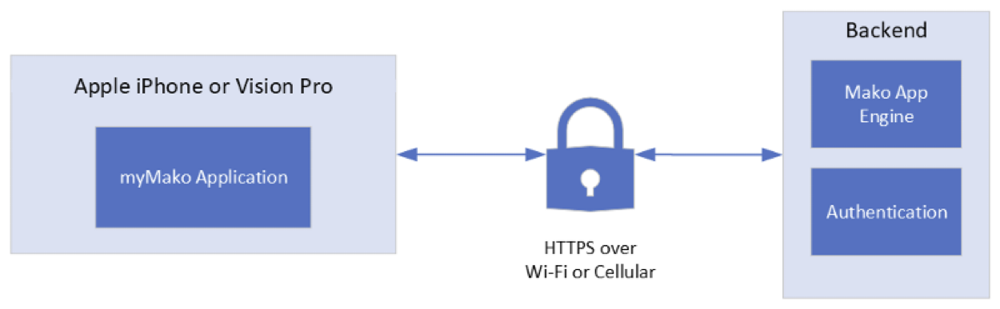

---
itemId:sw-366
itemType: Software Item Spec
itemTitle: System Context
itemFulfills: 
Software item type: SADD
---
### Description
This chapter defines the borders between this application and its external systems and dependencies (The iPhone or Vision Pro Hardware and Operating System and the Backend). It identifies all external interfaces between them. 
 

 
The myMako application relies on two external components interface via the HTTPS protocol.
Apple iPhone or Apple Vision Pro – Hardware device with an internet connection
Backend APIs are required by the application to authenticate user, transfer cases and Mako plan data.