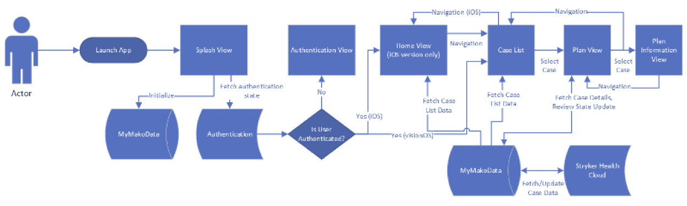

---
itemId:sw-392
itemType: Software Item Spec
itemTitle: Runtime View
itemFulfills: 
Software item type: SADD
---
### Description
The following diagram shows the sequence of steps executed when the user starts the myMako Application (on either iOS or visionOS).

  