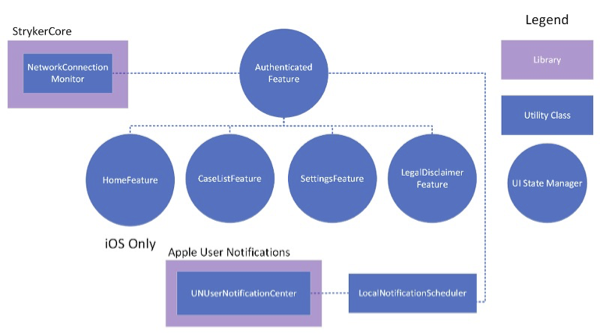

---
itemId:sw-199
itemType: Software Item Spec
itemTitle: Detail Design Aspect 2: Authenticated Feature
itemFulfills: MMA-2853,MMA-2854,MMA-2856,MMA-2858,MMA-2860,MMA-2861,MMA-2862,MMA-2863,MMA-2864,MMA-2865,MMA-2867,MMA-2868,MMA-2869,MMA-2870,MMA-2871,MMA-2872,MMA-2874,MMA-2875,MMA-2876,MMA-2877,MMA-2878,MMA-2879,MMA-2880,MMA-2881,MMA-2883,MMA-2884,MMA-2885,MMA-2886
Software item type: SDD
---
Once authentication has completed and the AuthenticatedFeature is created to render the post-authentication UI on top. This is the entry point for the main flow of the application after authentication and it differs slightly between the iOS and visionOS platforms.
 
The Authenticated Feature has the following child features -
1. Home Feature (iOS only)
2. Case List Feature
3. Settings Feature
4. Legal Disclaimer Feature
 
The Authenticated Feature is responsible for the following key functionalities -
* It listens for network availability and reachability using the StrykerCore NetworkConnectionMonitor and displays a notification message if the device loses an internet connection. This message is displayed on top of the UI for any and all child features.
* It listens for events that trigger a child feature. These events could be a user's selection or a notification alert or a delegate request from another child feature. 
	* The child feature sends a case list or case detail selection reducer action delegate request, the Authenticated Feature switches to the Cases tab (on iOS) and tells the Case List feature that case details were requested for a case with the provided identifier via a reducer action.
* It listens for environment updates using the StrykerAuth AIAppEngine. When an environment is updated, it clears the current data using MyMakoData's DataClient and refreshes the data after updating the environment in DataClient.
* It listens for upcoming procedures updates using MyMakoData's DataClient. Whenever there is an update, it clears & reschedule the day count notifications for all future dates using LocalNotificationScheduler utility object.
 
The post-authentication UI (entry point) based on the platform is defined below - 

7.1.2.1 iOS
A tab bar is displayed, defaulting to the Home Feature UI. When the user selects the Cases or the Settings tab, the correspondingly-named features (UI managers) are invoked.
 
7.1.2.2 visionOS
The Case List Feature is displayed, and there is no tab-based navigation UI present on the screen. Instead of a "Settings" tab or button, the UI displays a "More" button on the top right of the application which performs the same functions as the settings UI on iOS.
 
 