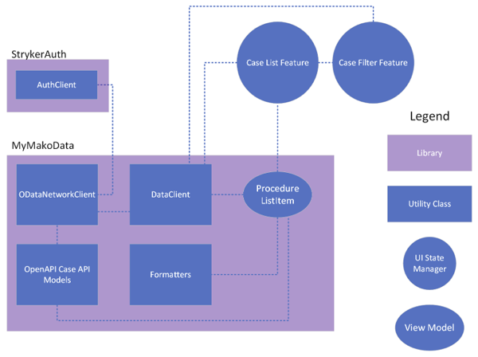

---
itemId:sw-236
itemType: Software Item Spec
itemTitle: Detail Design Aspect 4: Case List Feature & Case Filter Feature
itemFulfills: Automatic refresh ,MMA-2914,MMA-2915,MMA-2916,MMA-2917,MMA-2918,MMA-2919,MMA-2920,MMA-2921,MMA-2922,MMA-2923,MMA-2924,MMA-2926,MMA-2927,MMA-2928,MMA-2929,MMA-2931,MMA-2932,MMA-2933,MMA-2934,MMA-2935,MMA-2936,MMA-2937,MMA-2938,MMA-2939,MMA-2940,MMA-2941,MMA-2942,MMA-2943,MMA-2944,MMA-2945,MMA-2946,MMA-3067,MMA-3068,MMA-3070,MMA-3071
itemHasParent: sw-238
Software item type: SDD
---
The Case List Feature reducer responds to external actions requesting that the case details UI be displayed. It also provides actions for displaying the case filter UI using the Case Filter Feature child feature.
 
The Case List Feature calls the `fetchProcedures(filters:)` API method on DataClient to retrieve the available cases for the user matching a CaseFilters filter object. This method is called whenever the view appears, or the user pulls to refresh. The filter defaults to upcoming cases. It subscribes to the AsyncStream returned by `fetchProcedures` which returns a tuple containing the state of both the network request and an array of ProcedureListItems. If the filter is changed, the stream is terminated and re-initialized with a new filter. If the stream returns an error in the network request, or an underlying error prevents the stream from receiving any updates, the UI does not display the error (the error is logged but not displayed).
 
The reducer for the Case List Feature creates a the Case Filter Feature when the filter button is selected from the UI. The Case Filter Feature sends delegate reducer actions back to its parent to update the filter, triggering a new AsyncStream to be created and subscribed to.
 
The Case Filter Feature also calls the `fetchProcedures(filters:)` API method on DataClient to retrieve the available cases for the user matching a CaseFilters filter object, however it maintains its own copy of the CaseFilters object which it uses to update the AsyncStream used by the UI to count the number of cases that match the filter whenever a filter UI element (such as the scheduled date) is changed. Only after the user finalizes their filter and selects the "Show" button, does the Case Filter Feature invoke the delegate reducer action to update the filter used by the parent.
 
 