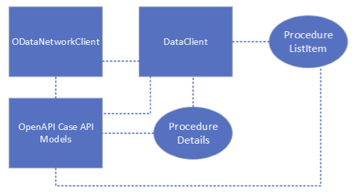

---
itemId:sw-239
itemType: Software Item Spec
itemTitle: MyMakoData Library
itemFulfills: 
Software item type: SDD
---
This library coordinates REST API calls to the Mako App Engine, retrieves and manages asset files for the Mako Plan based on the user's available disk space, formats data (including decimal numbers, deformities, laxities, angulation, and resection values) in the same way the Mako controller displays the data.
 
MyMakoData is the primary interface for the UI's interaction with Case and Mako Plan data.
 
Additionally, the MyMakoData library performs a caching function, allowing the application to be used for a limited time while the device is offline or has no connectivity to the Mako App Engine REST API. It is responsible for enforcing the data retention policy whenever the app is launched.
 
Lastly the MyMakoData library abstracts all the networking and database layers away from the application usually in the form of AsyncStreams or AsyncThrowingStreams.

This library does not handle errors. Any errors generated by an API call result in either an error thrown upstream to the consuming app. Some observation API calls swallow all errors and do not emit anything upstream. If an API method returns an AsyncStream (which does not throw), it either finishes or remains open indefinitely depending on the context. The application is expected to monitor outside state (such as network reachability, file system write-ability, etc) and enable/disable UI components that rely on a MyMakoData API call, or alert the user to the issue at hand. The application may then close any indefinite streams.
 
 